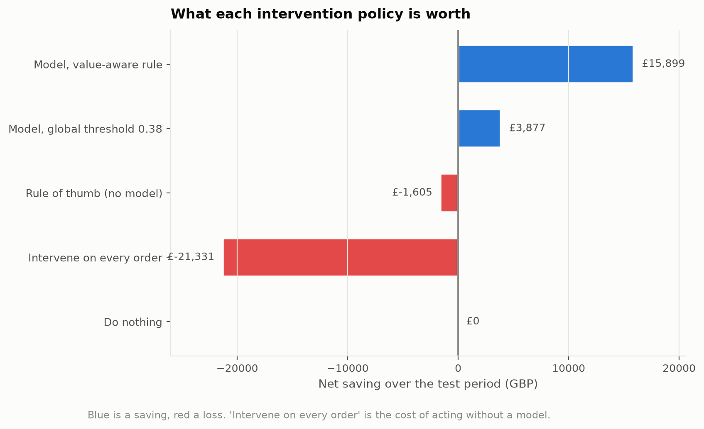
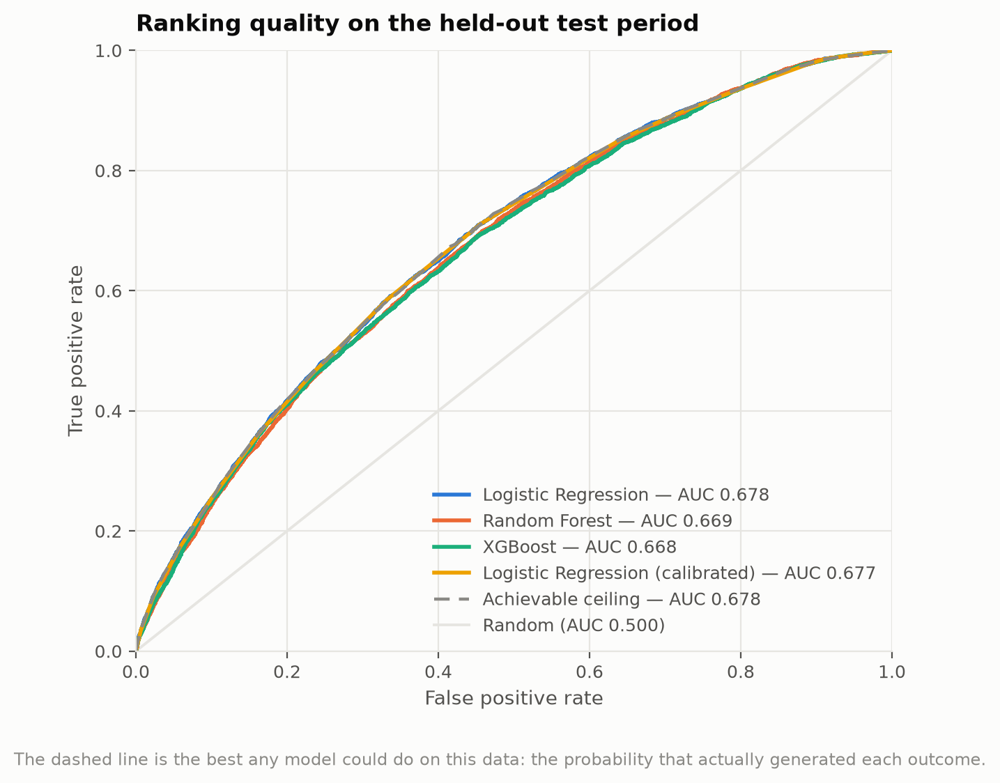
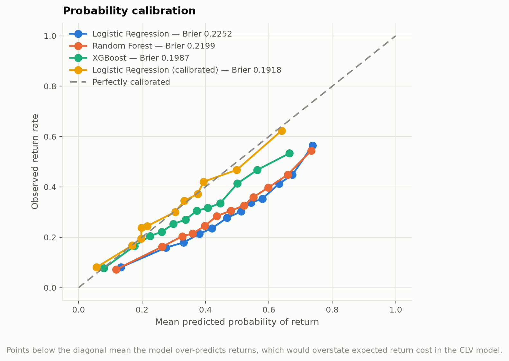
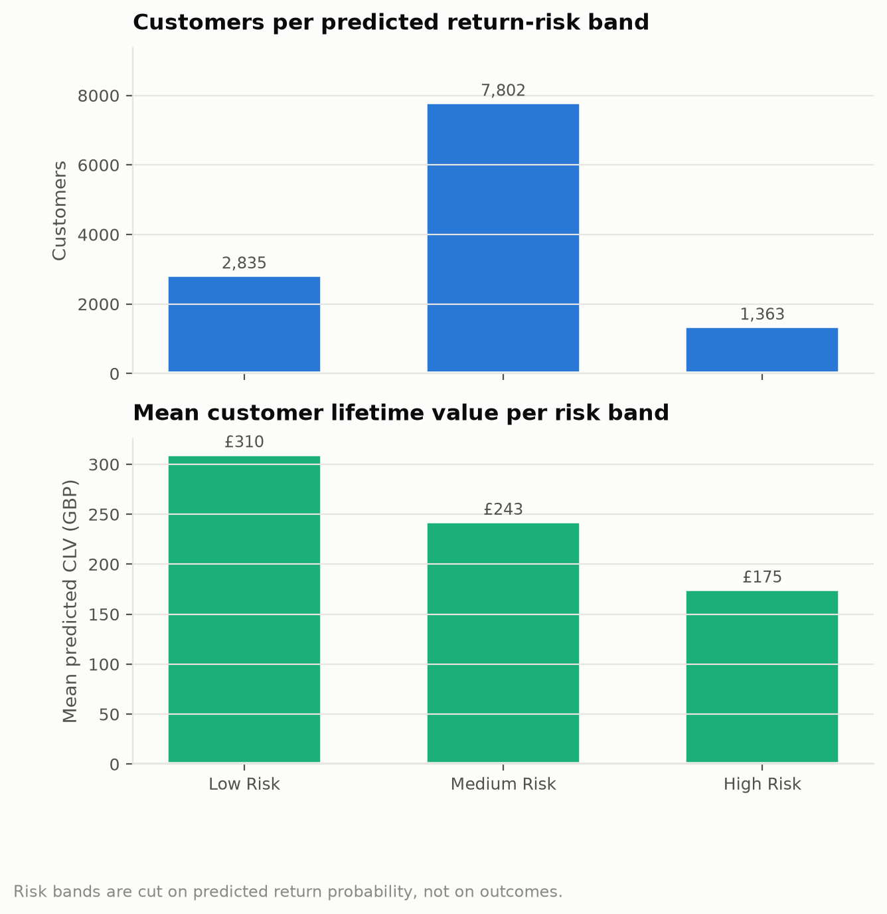
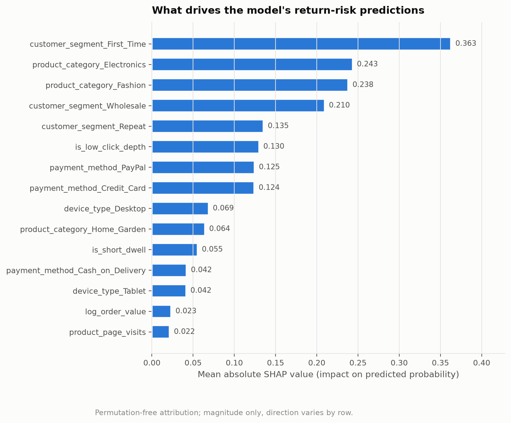
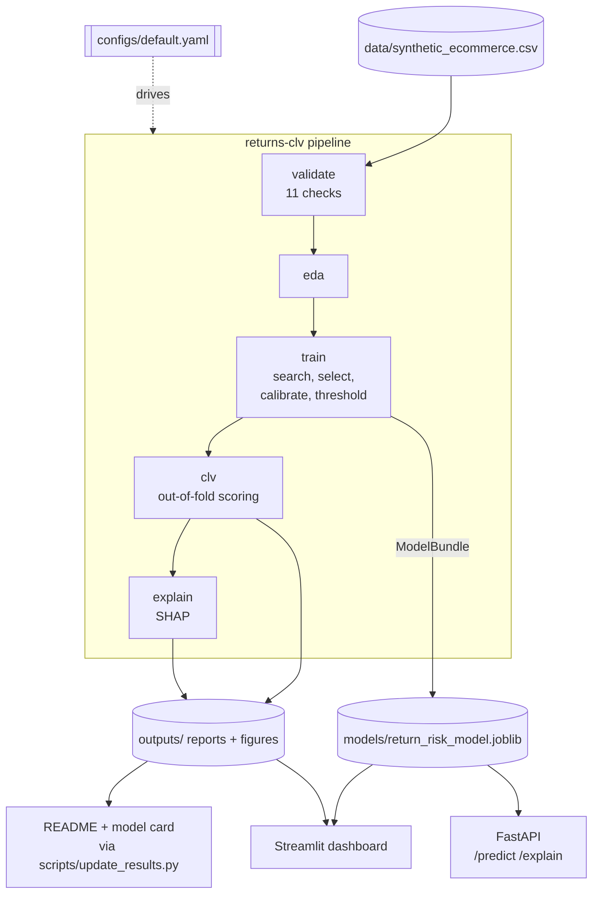

# Predicting e-commerce returns, and what it's worth

[](https://github.com/singhm8755/7150CEM-Ecommerce-Returns-CLV/actions/workflows/ci.yml)


Returns are the quiet margin killer in online retail: the sale is recorded, the
stock comes back, and the profit is gone. This project predicts, at checkout,
which orders will be returned — then answers the question that actually decides
whether the model gets deployed: **is acting on that prediction worth more than
it costs?**

An end-to-end pipeline takes raw transactions through validation, exploratory
analysis, model training, customer lifetime value and explainability, and ships
the result as a REST API, a Docker image and an interactive dashboard.

> Coventry University 7150CEM data science project. The five coursework
> notebooks are preserved in [`notebooks/`](notebooks/); everything else is a
> production reimplementation of them, and
> [`docs/methodology.md`](docs/methodology.md) documents every place the two
> differ and why.

---

## Headline results

<!-- BEGIN:headline -->
| Result | Value | Context |
| --- | --- | --- |
| Test ROC-AUC | **0.677** | against an achievable ceiling of 0.678 |
| Share of achievable signal captured | **99.4%** | the remaining gap is irreducible noise |
| Average precision | 0.450 | no-skill baseline 0.297 |
| Brier score | 0.192 | calibrated, so the probabilities can be multiplied by money |
| Best intervention policy | **£15,899** | Model, value-aware rule, over the 18,121-order test period |
| Same intervention without a model | -£21,331 | intervening on every order destroys value |
| Portfolio lifetime value | £3,010,819 | 12,000 customers, 3-year horizon |
<!-- END:headline -->

The second row is the one worth pausing on. The project proposal targeted
ROC-AUC ≥ 0.80. That target was never achievable — because this dataset is
synthetic with a documented generating process, the exact probability behind
every outcome is recoverable, and scoring *that* gives the best result any model
could possibly reach. On this data, that ceiling is ≈ 0.68. The remaining gap to
1.0 is a coin flip, not a modelling failure.

So "ROC-AUC 0.68, short of the 0.80 target" and "captures 99% of the available
signal" describe the same model. Only the second tells you anything.
[Section 8 of the methodology](docs/methodology.md#8-report-against-the-achievable-ceiling)
covers what to do when no such ceiling is computable.

---

## The commercial argument

A return-risk score is only useful if acting on it beats not acting on it. The
pipeline models the money directly:

```
cost of a return     = margin forgone + two-way logistics + restocking loss
value of intervening = P(return) × effectiveness × cost of return − intervention cost
```

Intervening pays when the expected saving clears its cost. Since the saving
scales with order value and the intervention costs the same either way, **the
optimal rule is value-aware rather than a single probability cut-off**: a 40%
risk on a £900 order is worth acting on, the same 40% on a £15 order is not.

Measured on the held-out test period, against the alternatives a retailer would
otherwise pick:

<!-- BEGIN:policies -->
| Policy | Orders flagged | Intervention spend | Gross saving | **Net** |
| --- | ---: | ---: | ---: | ---: |
| Model, value-aware rule | 3,915 (22%) | £18,596 | £34,496 | **£15,899** |
| Model, global threshold 0.38 | 4,068 (22%) | £19,323 | £23,200 | **£3,877** |
| Do nothing | 0 (0%) | £0 | £0 | **£0** |
| Rule of thumb (no model) | 8,332 (46%) | £39,577 | £37,972 | **-£1,605** |
| Intervene on every order | 18,121 (100%) | £86,075 | £64,744 | **-£21,331** |
<!-- END:policies -->

Intervening on everything loses money. A plausible hand-written rule — flag cash
on delivery and first-time buyers — also loses money. Targeting by expected
value is what turns the model into profit.



---

## What makes this more than a notebook

The original coursework produced respectable-looking metrics. Rebuilding it
surfaced five methodological problems that were inflating them, and two defects
in the dataset itself. Each fix is measured rather than asserted — run
`make experiments` to reproduce the numbers.

| Problem found | Why it inflates results | Fix |
| --- | --- | --- |
| SMOTE applied before cross-validation | Synthetic points interpolate across fold boundaries, so folds are scored on echoes of their own data | Resampling is a step inside an `imblearn` pipeline, applied per fold |
| Scaler fitted on all data before splitting | Test-set statistics inform the training transform | All preprocessing fitted inside the estimator |
| Decision threshold tuned on the test set | Reports the best cut-off in hindsight, which nobody could pick in advance | Threshold chosen on a held-out validation half |
| `LabelEncoder` on nominal categories | Asserts `Credit_Card < PayPal`, an ordering that does not exist | One-hot encoding, unknown-safe for serving |
| CLV scored in-sample | Customer risk scores are part memory, not prediction | Out-of-fold scoring, with the earliest block backcast |
| `order_frequency_12m` contradicts the transaction history on **93.5%** of rows | CLV multiplies by frequency, so the error propagates straight into pounds | Validation flags it; CLV uses observed orders per active year |
| `customer_tenure_days` constant within each customer | Stamped once per customer rather than measured at order time | Flagged by validation; the regenerated dataset computes it causally |

### Measured: what resampling before cross-validation costs you

<!-- BEGIN:experiment_leakage -->
| Protocol | Cross-validated average precision | Test average precision | Optimism gap |
| --- | ---: | ---: | ---: |
| Resampling inside cross-validation (correct) | 0.4173 | 0.4068 | **+0.0104** |
| Resampling before cross-validation (leaky) | 0.8626 | 0.4068 | **+0.4558** |

Resampling first inflates the reported cross-validated score by +0.4454 without improving the model.
<!-- END:experiment_leakage -->

The inflated cross-validation score is the dangerous part. The test score barely
moves, so nothing looks wrong — the model simply under-performs its own
documentation once deployed.

### Measured: what tuning a threshold on the test set costs you

<!-- BEGIN:experiment_threshold -->
| Threshold chosen on | Threshold | F1 reported on the test set |
| --- | ---: | ---: |
| Validation (correct) | 0.32 | 0.4831 |
| Test set (the mistake) | 0.25 | 0.4899 |

Tuning on the test set overstates F1 by +0.0068 — an improvement nobody could have obtained in advance.
<!-- END:experiment_threshold -->

### Measured: whether the engineered features earned their place

<!-- BEGIN:experiment_ablation -->
| Model | Raw columns only | With engineered features | Change |
| --- | ---: | ---: | ---: |
| Logistic Regression | 0.4580 | 0.4617 | **+0.0037** |
| Random Forest | 0.4069 | 0.4068 | **-0.0001** |
| XGBoost | 0.4344 | 0.4394 | **+0.0049** |

_Test-set average precision._
<!-- END:experiment_ablation -->

The answer depends on the model class, which is why the ablation runs across all
of them. A tree ensemble discovers a threshold effect like `click_depth <= 3` by
splitting on the raw column, so the indicator adds little; a linear model cannot
represent it at all and has to be handed it. Reporting only the tree result
would have made the features look worthless.

---

## Model comparison

<!-- BEGIN:models -->
| Model | CV average precision | Test ROC-AUC | Test average precision | Fit time |
| --- | --- | --- | --- | --- |
| Majority-class baseline | — | 0.5000 | 0.2969 | 0s |
| **Logistic Regression** | 0.4635 | 0.6779 | 0.4617 | 23s |
| Random Forest | 0.4539 | 0.6693 | 0.4464 | 248s |
| XGBoost | 0.4537 | 0.6682 | 0.4480 | 42s |
| _Achievable ceiling_ | — | _0.6784_ | _0.4578_ | — |
<!-- END:models -->

Every candidate sits within a hair of the ceiling and of each other, so the
simplest model wins on interpretability, latency and maintenance cost. Knowing
*why* they converge — rather than reaching for a bigger model — is the point.

The ceiling row is itself estimated on the same finite test sample, so a model
can land a fraction above it by chance — as logistic regression does on average
precision here. That is sampling noise in the estimate, not a model beating
information theory; the gap is well inside what 18,121 rows can resolve.



Probability calibration is treated as a first-class requirement, not a
footnote: the CLV model multiplies these probabilities by pound amounts, and
ROC-AUC is completely blind to a model that ranks well but is systematically
overconfident.



---

## Customer lifetime value

Each customer's discounted three-year contribution, net of the returns the model
expects them to make:

```
CLV = Σ  annual contribution × retention^(t−1) / (1 + discount)^t
```

<!-- BEGIN:clv_segments -->
| Risk band | Customers | Mean predicted return rate | Actual return rate | Mean CLV |
| --- | ---: | ---: | ---: | ---: |
| Low Risk | 2,835 | 16.7% | 17.2% | £310 |
| Medium Risk | 7,802 | 31.6% | 31.6% | £243 |
| High Risk | 1,363 | 43.1% | 42.9% | £175 |
<!-- END:clv_segments -->

Predicted and actual return rates track each other to within half a percentage
point in every band — the payoff from calibrating, and what makes the bands
usable for targeting at all.

The band edges are derived rather than chosen: 0.40 is the probability at which
intervening breaks even on an order of average value, so "high risk" means
"worth acting on" instead of an arbitrary round number.

**Targeting customers is worth far less than targeting orders.** Intervening on
every order from the 1,363 high-risk customers adds about £4,900 of lifetime
value, against £15,899 from flagging individual orders over a single test
period. Averaging a customer's risk throws away the variation across their
orders, and that variation is where most of the money is. The customer view is
the right one for retention and segmentation; the order view is the right one
for intervention.

The dashboard exposes the unit economics as sliders, because an assumption the
reader can move is more honest than one buried in a config file.



---

## What drives a prediction

<!-- BEGIN:features -->
| Feature | Mean absolute SHAP | Pushes |
| --- | ---: | --- |
| `customer_segment_First_Time` | 0.3629 | towards a return |
| `product_category_Electronics` | 0.2435 | towards keeping |
| `product_category_Fashion` | 0.2382 | towards a return |
| `customer_segment_Wholesale` | 0.2095 | towards keeping |
| `customer_segment_Repeat` | 0.1354 | towards a return |
| `is_low_click_depth` | 0.1300 | towards a return |
| `payment_method_PayPal` | 0.1246 | towards keeping |
| `payment_method_Credit_Card` | 0.1243 | towards keeping |
| `device_type_Desktop` | 0.0687 | towards keeping |
| `product_category_Home_Garden` | 0.0643 | towards keeping |
<!-- END:features -->

These match the documented data-generating process — the check that matters,
since attributions contradicting the known process would mean the model was
fitting noise whatever its metrics said. Every individual prediction is
explainable too, via `POST /explain`.



---

## Quick start

```bash
git clone https://github.com/singhm8755/7150CEM-Ecommerce-Returns-CLV.git
cd 7150CEM-Ecommerce-Returns-CLV

make setup          # virtualenv + install
make all            # full pipeline: validate -> eda -> train -> clv -> explain
make api            # scoring API at http://localhost:8000/docs
make dashboard      # dashboard at http://localhost:8501
```

`make help` lists every target. The full pipeline takes about seven minutes on
four cores.

### Scoring a transaction

```bash
curl -X POST http://localhost:8000/predict \
  -H 'Content-Type: application/json' \
  -d '[{"product_category":"Fashion","payment_method":"Cash_on_Delivery",
        "device_type":"Mobile","customer_segment":"First_Time",
        "order_value_gbp":129.99,"click_depth":2,"time_on_page_seconds":35,
        "product_page_visits":3,"customer_tenure_days":12,"order_frequency_12m":1}]'
```

```json
{
  "model_name": "Logistic Regression",
  "threshold": 0.38,
  "predictions": [{
    "return_probability": 0.7308,
    "risk_band": "High_Risk",
    "flagged_by_threshold": true,
    "flagged_by_expected_value": true,
    "expected_return_cost_gbp": 36.54,
    "expected_intervention_saving_gbp": 4.38,
    "recommended_action": "intervene: expected saving exceeds the intervention cost"
  }]
}
```

Every response carries both decisions — the global threshold and the
expected-value rule — plus the pounds behind the recommendation, so the caller
can apply whichever matches their operating policy.

`POST /explain` returns the reasoning behind any single score:

```json
{
  "return_probability": 0.7308,
  "top_contributions": [
    {"feature": "customer_segment_First_Time",     "contribution":  0.478, "direction": "increases return risk"},
    {"feature": "payment_method_Cash_on_Delivery", "contribution":  0.269, "direction": "increases return risk"},
    {"feature": "is_low_click_depth",              "contribution":  0.231, "direction": "increases return risk"},
    {"feature": "product_category_Fashion",        "contribution":  0.225, "direction": "increases return risk"}
  ]
}
```

Those are exactly the factors that generated the data — first-time buyer,
cash on delivery, a rushed browsing session, a fashion item — which is the
check that matters: a model citing drivers that contradict the known process
would be fitting noise whatever its metrics said.

### In Docker

```bash
make docker-build
make docker-run     # mounts ./models read-only; the image carries no data
```

---

## How it is put together



The bundle is the seam: training writes it, and the API, the dashboard and the
CLV stage all read it. Because it carries the fitted preprocessing as well as
the model, there is only ever one implementation of the feature logic.

```
├── src/returns_clv/          the pipeline, as an installable package
│   ├── config.py             typed configuration, validated on load
│   ├── data/
│   │   ├── generate.py       synthetic data with a documented generating process
│   │   └── validate.py       11 checks, PASS / WARN / FAIL
│   ├── features.py           engineering + preprocessing, inside the estimator
│   ├── splits.py             temporal (default), random and grouped protocols
│   ├── models.py             model zoo; resampling lives inside the pipeline
│   ├── train.py              search -> select -> calibrate -> threshold -> evaluate
│   ├── evaluate.py           metrics, thresholds and the money model
│   ├── clv.py                out-of-sample scoring, lifetime value, policy simulation
│   ├── explain.py            SHAP, global and per-prediction
│   ├── experiments.py        measures what each methodology fix is worth
│   ├── plots.py              one house style, colour-vision-safe
│   └── cli.py                `returns-clv <stage>`
├── api/main.py               FastAPI service
├── dashboard/app.py          Streamlit dashboard
├── notebooks/                the original coursework, de-Colab'd
├── configs/default.yaml      every parameter the pipeline depends on
├── tests/                    139 tests
└── docs/                     methodology, model card, data dictionary
```

Three properties hold throughout:

**Configuration over code.** Every distribution, effect size, split proportion
and pound figure lives in `configs/default.yaml` and is loaded into validated
dataclasses. An experiment is a config change.

**One code path from input to decision.** The saved artefact bundles the fitted
pipeline, the operating threshold, the expected input columns and its own
provenance. Training, the API, the dashboard and the CLV stage all load the same
bundle, so there is no second implementation of the feature logic to drift.

**Documentation generated from artefacts.** Every results table above is written
by `scripts/update_results.py` from the JSON in `outputs/reports/`. A stale
number is worse than no number, because nothing signals that it is wrong.

---

## Testing and CI

```bash
make test        # 139 tests
make test-fast   # skips the model-training tests
make lint        # ruff check + format
```

The tests cover behaviour rather than implementation — that a temporal split
never trains on the future, that a grouped split leaks no customer, that the
feature engineer produces identical values on a subset and the whole (so it
cannot leak), that CLV falls as return risk rises, that the API rejects
out-of-domain input, and that **no model ever exceeds the information-theoretic
ceiling**, which would be the signature of a leak.

CI runs lint, the suite on Python 3.10–3.12, a full pipeline smoke run on a
reduced budget, and a Docker build with a health check.

---

## Data

120,000 synthetic transactions from 12,000 customers over 24 months, 29.5%
returned. Schema, generating process and known defects are in
[`docs/data_dictionary.md`](docs/data_dictionary.md).

Validation against the committed dataset:

<!-- BEGIN:validation -->
| Check | Status | Detail |
| --- | --- | --- |
| `schema` | PASS | all 14 required columns present |
| `missing_values` | PASS | no missing values |
| `duplicate_ids` | PASS | transaction_id is unique |
| `feature_bounds` | PASS | 4 features within documented bounds |
| `target_binary` | PASS | returned is binary |
| `class_balance` | PASS | positive rate 20.50%, majority:minority 3.88:1 |
| `customer_invariants` | PASS | customer_segment constant per customer |
| `tenure_consistency` | PASS | tenure increases with transaction date |
| `order_frequency_consistency` | PASS | matches observed trailing-12-month counts |
| `business_logic` | PASS | COD 27.2% vs other 19.6% (as expected); segments First_Time 40.0% > Repeat 26.2% > Wholesale 9.6% (confirmed) |
| `dgp_calibration` | PASS | observed 20.50% vs DGP expectation 20.62% (gap 0.12%) |
<!-- END:validation -->

Two warnings, both genuine. A validation suite that passes everything is not
evidence that the data is clean — only that the suite is not looking.

`returns-clv generate` produces a dataset free of both defects, with history
features computed as of each transaction date.

---

## Reading further

| Document | What it covers |
| --- | --- |
| [`docs/methodology.md`](docs/methodology.md) | Every methodological decision, with measurements |
| [`docs/model_card.md`](docs/model_card.md) | Performance, limitations, ethical considerations |
| [`docs/data_dictionary.md`](docs/data_dictionary.md) | Schema, generating process, known defects |
| [`docs/deployment.md`](docs/deployment.md) | Hosting the dashboard, the API container, local setup |
| [`notebooks/`](notebooks/) | The original coursework analysis |

## Limitations

The data is synthetic, so the coefficients transfer to nothing — the pipeline,
evaluation protocol and serving path are the deliverable. The unit economics are
plausible assumptions rather than measurements, and every pound figure inherits
that uncertainty. `intervention_effectiveness = 0.25` in particular would need
an A/B test to establish. See the
[model card](docs/model_card.md#limitations) for the full list.

## Licence

MIT.
